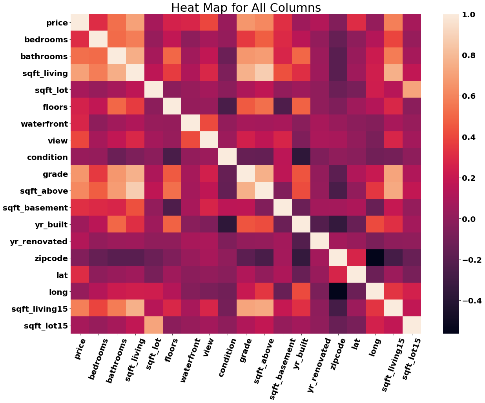

# Seattle Housing Market With Multi-Linear Regression
** By Yevgeniy Kostrov
***
Analysis of Seattle Housing Market with Multi-Linear Regression
# Overview
The purpose of this project is to analyze a data set containing data  
about houses sold in Seattle, WA. During the analysis, I will try to isolate the features that are the best predictors of the price by using Linear Regression.

# Business Problem

The fair price of the house is a hard quantity to assess. Both sellers and buyers would like to know the best price for the house. Which features of the property would be the best predictors of the value? I will build a regression model that can predict the value of the house.
I will, also, check the necessary statistical assumptions for the regression model.

# Data 
The file called ['kc_house_data.csv'](https://github.com/ekostrov/SeattleHouseMultiLinearRegression/blob/main/data/kc_house_data.csv) holds the data for this project.

## Cleaning/Modifying Data:

* I removed 'NaN' values
* I converted categorical data that represents 'float' data into 'float' type.
* Some data wrangling was performed during Regression modeling.

# Modeling

## My first goal was to create linear regression model with one independent variable.
* I created the correlation matrix and heat map for visualization purpose.

* 'sqft_living' has the highest correlation of  0.71 with the 'price'. 
* I build a regression model for the 'price' to be predicted by 'sqft_living'
* I used statistical tests and visualization to check whether the assumptions of the Linear Regression hold.
* For the details please see the Jupyter Notebook.
## Conclusions for the Linear Model:
1. I received the following linear model 
 

 

where 

