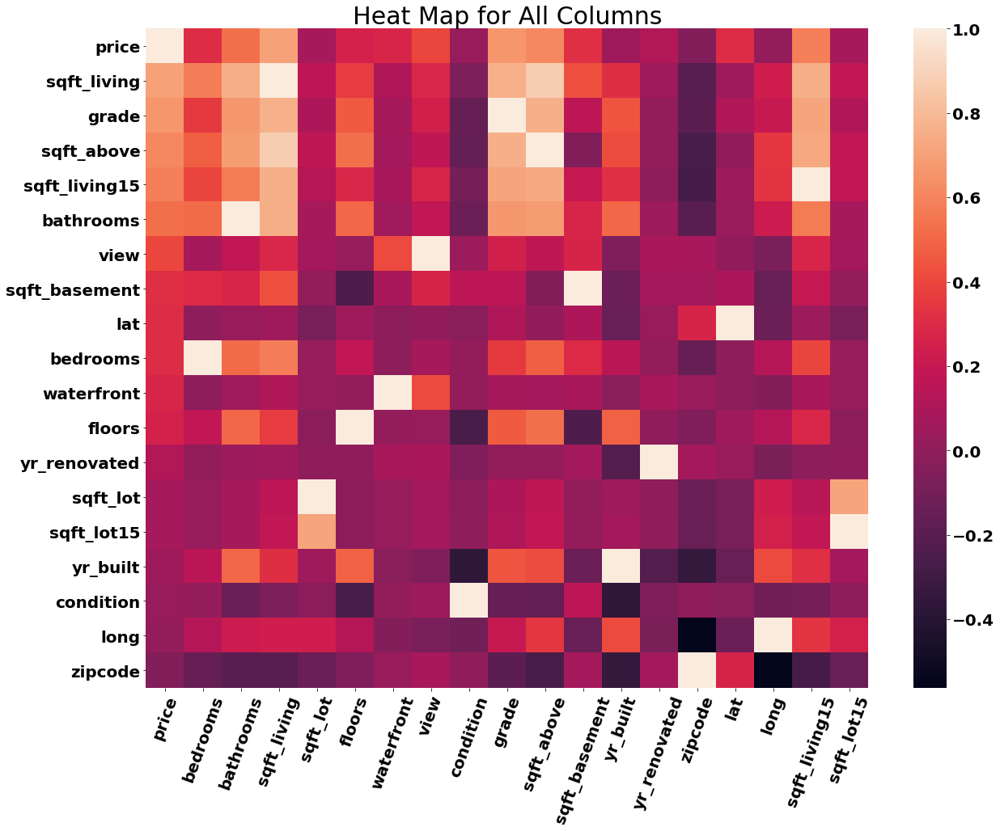
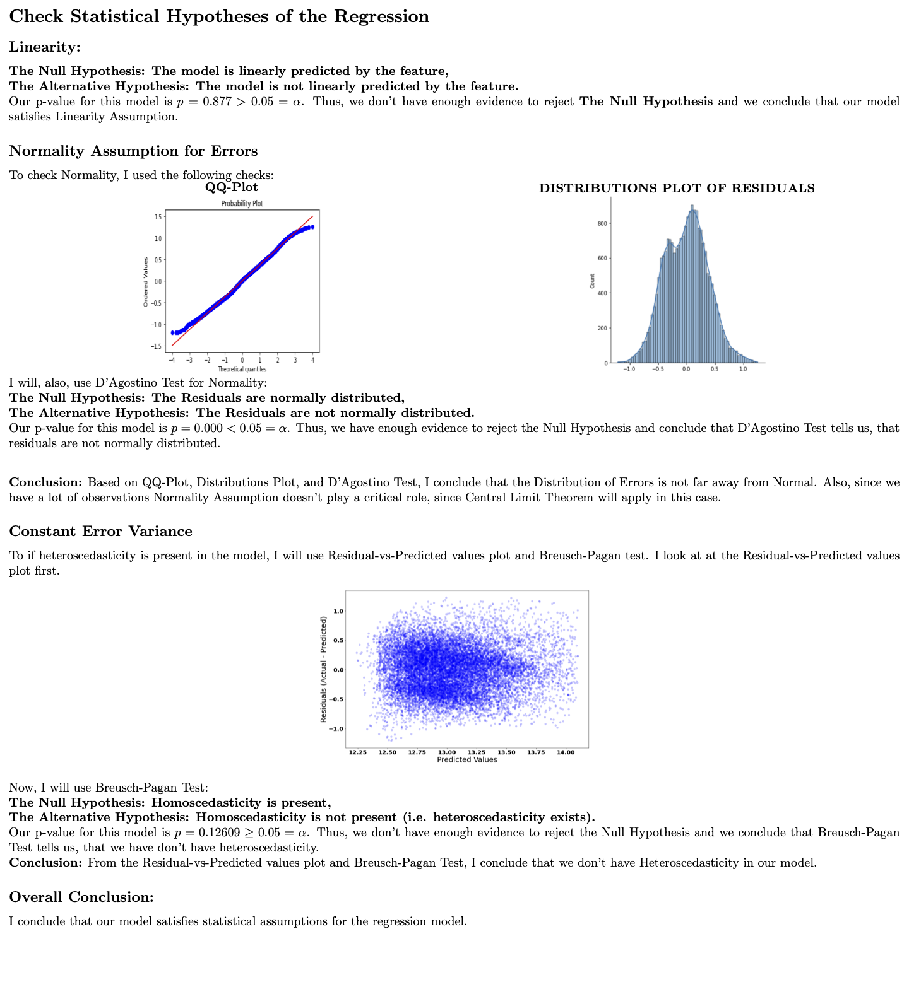
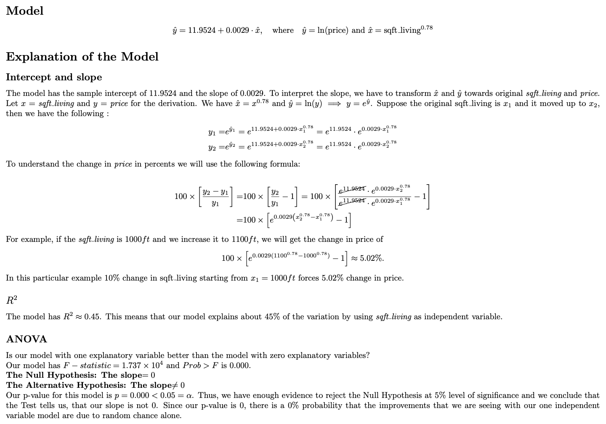
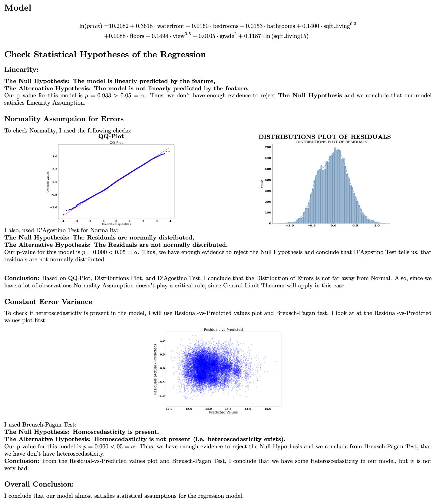

# Linear Regression Analysis of the Kings County's (Seattle, WA) House Market by
** By Yevgeniy Kostrov
***

# Overview
The purpose of this project is to analyze a data set containing data 
about houses sold in Kings County (Seattle, WA). 

During the analysis:
1. I will perform necessary data wrangling first.
2. I will build a Linear Regression Model with one explanatory variable.
> * I will check statistical asumptions for the linear regression model
> * I will explain the model, including intercept, coefficient for the explanatory variable, $R^2$, and *ANOVA*
3. I will build a Multiple Linear Regression Model with many explanantory variables.
> * I will check statistical asumptions for the multiple linear regression model
> * I will explain the model, including intercept, coefficients for the explanatory variables, $R^2$, and *ANOVA*

# Business Problem

The fair price of the house is a hard quantity to assess.
Both sellers and buyers would like to know the best price for the house. 
Which features of the property would be the best predictors of the value?
I will build a regression model that helps to predict the value of the house. 
I will, also, check the necessary statistical assumptions for the regression model 
and explain the model's parameters. 

# Data Description
The file called ['kc_house_data.csv'](https://github.com/ekostrov/SeattleHouseMultiLinearRegression/blob/main/data/kc_house_data.csv) holds the data for this project.

This project will use the data about Kings County's(Seattle, WA) housing market. The data file contains the following columns:
#### Column Names and descriptions for Kings County Data Set
* **id** - unique identified for a house
* **dateDate** - house was sold
* **pricePrice** -  is prediction target
* **bedroomsNumber** -  of Bedrooms/House
* **bathroomsNumber** -  of bathrooms/bedrooms
* **sqft_livingsquare** -  footage of the home
* **sqft_lotsquare** -  footage of the lot
* **floorsTotal** -  floors (levels) in house
* **waterfront** - House which has a view to a waterfront
* **view** - Has been viewed
* **condition** - How good the condition is ( Overall )
* **grade** - overall grade given to the housing unit, based on King County grading system
* **sqft_above** - square footage of house apart from basement
* **sqft_basement** - square footage of the basement
* **yr_built** - Built Year
* **yr_renovated** - Year when house was renovated
* **zipcode** - zip
* **lat** - Latitude coordinate
* **long** - Longitude coordinate
* **sqft_living15** - The square footage of interior housing living space for the nearest 15 neighbors
* **sqft_lot15** - The square footage of the land lots of the nearest 15 neighbors

## Cleaning/Modifying Data:

* I removed 'NaN' values
* I converted categorical data that represents 'float' data into 'float' type.
* Some data wrangling was performed during Regression modeling to improve the results and to satisfy the statistical assumptions of the linear regression.

# Modeling

## My first goal was to create linear regression model with one independent variable.
* I created the correlation matrix and heat map for visualization purpose.

* 'sqft_living' has the highest correlation of  0.71 with the 'price'. 
* I build a regression model for the 'price' to be predicted by 'sqft_living'
* I used statistical tests and visualization to check whether the assumptions of the Linear Regression hold.
* For the details please see the Jupyter Notebook.
## Linear Model: Check Statistical Hypothesis of the Regression

<embed src="https://github.com/ekostrov/SeattleHouseMultiLinearRegression/blob/main/images/document2.png">
        
 For better quality, please download the PDF to view it: <a href="https://github.com/ekostrov/SeattleHouseMultiLinearRegression/blob/main/images/document2.pdf">Download PDF</a>.

</embed>
</object>
## Linear Model: Explanations

<embed src="https://github.com/ekostrov/SeattleHouseMultiLinearRegression/blob/main/images/document.png">
        
 For better quality, please download the PDF to view it: <a href="https://github.com/ekostrov/SeattleHouseMultiLinearRegression/blob/main/images/document.pdf">Download PDF</a>.

</embed>
</object>
***
# Multiple Regression Model
***

## I included many explanatory variables and build Multiple Regression Model.
> ### * Based on the Heat Map, I used the columns that have the highest correlation with the *price* column.
>### * I went through few stages in the process of building the model, until most statistical assumptions were closed to being satisfied.
## Here  is the model that I have:
## Multiple Linear Model: Check Statistical Hypothesis of the Regression

<embed src="https://github.com/ekostrov/SeattleHouseMultiLinearRegression/blob/main/images/document3.png">
        
 For better quality, please download the PDF to view it: <a href="https://github.com/ekostrov/SeattleHouseMultiLinearRegression/blob/main/images/document3.pdf">Download PDF</a>.

</embed>
## Multiple Linear Model: Explanations
## Model 
<math>
x^2
</math>
ln(price) =10.2082 + 0.3618 · waterfront − 0.0160 · bedrooms − 0.0153 · bathrooms + 0.1400 · sqft living0.3 +0.0088 · floors + 0.1494 · view$^0.5$ + 0.0105 · grade2 + 0.1187 · ln (sqft living15)

<embed src="https://github.com/ekostrov/SeattleHouseMultiLinearRegression/blob/main/images/document4.png">
        
 For better quality, please download the PDF to view it: <a href="https://github.com/ekostrov/SeattleHouseMultiLinearRegression/blob/main/images/document4.pdf">Download PDF</a>.

</embed>
</object>